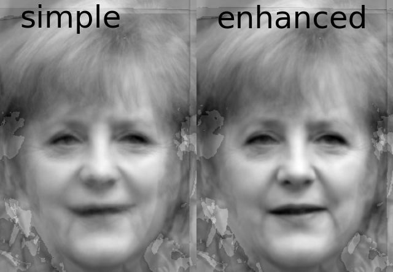

Automatic Face Alignment (AFA)
================
Carl M. Gaspar & Oliver G.B. Garrod

#### You have lots of photos of faces like this:


#### But you want to line up all of the faces like this:


<!-- #### Specifically, the locations of facial features should overlap across images, as you can confirm here: -->

<!--  -->
<!-- <p align="center" width="100%">
    
</p> -->
#### Perhaps you would also like to window the faces to show only inner facial features like this:


#### All of the above can be done using AFA like this:
```python
import alignfaces as afa

faces_path = "/Users/Me/faces_for_my_study/"
afa.get_landmarks(faces_path)
aligned_path = afa.align_procrustes(faces_path)
afa.get_landmarks(aligned_path)
the_aperture, aperture_path = afa.place_aperture(aligned_path)
```
To better understand how to write a script for your specific purposes, we direct you to [demo 1](demos/demo_1_alignment/README.md). [Demo 1](demos/demo_1_alignment/README.md) also describes how AFA alignment works.

All of these functions depend on reliable detection of facial landmarks, which is provided by the [DLIB](http://dlib.net) library. Alignment is based on generalized Procrustes analysis (GPA), which extensively unit tested.

# Additional functions (warping)
Automatic landmark detection means that it is also easy to separate **shape** and **texture** in order to produce various kinds of **warped** images.

AFA provides functions for two types of face-warping manipulations common in face perception research.

### Morphing between faces
<!-- Here we gradually morph between [Choi Min-sik](https://en.wikipedia.org/wiki/Choi_Min-sik) (on the far left) and [Sarah Silverman](https://en.wikipedia.org/wiki/Sarah_Silverman) (on the far right) in equal 9 steps:
 -->
To learn how to do this please see [demo 2](demos/demo_2_morphing/README.md).


### Enhanced average of facial identity
<!-- First we used AFA to align various photos of [Tony Blair](https://en.wikipedia.org/wiki/Tony_Blair) taken at different times and under different conditions. A simple average of these aligned faces is shown on the left.

Prior to averaging, we can also use AFA to warp each image of Tony Blair to match the average of landmark positions across each instance of Tony Blair. This enhanced average is shown on the far right.

<p align="center" width="100%">
    
</p> -->

<!-- This **enhanced facial average** was first demonstrated by

> Burton, A. M., Jenkins, R., Hancock, P. J. B., & White, D. (2005). Robust representations for face recognition: The power of averages. Cogn Psychol, 51(3), 256–284. https://doi.org/10.1016/j.cogpsych.2005.06.003

We used the same photos of Tony Blair as they used (in their Figure 3).

Manual landmark selection was required in Burton et al. (2005), whereas AFA automated the entire process in our demo. -->

To learn how to do this please see [demo 3](demos/demo_3_averaging/README.md).


# Setup

It is highly recommended that you have **conda** installed, preferably **miniconda** rather than full fat **anaconda**.

If you do have **conda**, then do the following to install:
```
conda create --name myenv conda-forge::dlib "python>=3.9" scikit-image

conda activate myenv

pip install "alignfaces @ git+https://git@github.com/SourCherries/auto-face-align.git"
```

This will create a new virtual environment called `myenv`. You can use another name for that. You'll need to activate this environment using `conda activate myenv` whenever you want to use AFA. To deactivate, simply type `conda deactivate myenv`.

Windows users may encounter a problem with plotting. That is a [general issue](https://stackoverflow.com/questions/69786885/after-conda-update-python-kernel-crashes-when-matplotlib-is-used) with **Matplotlib** on Windows. To fix, simply type the following while your `myenv` is activated:

```
conda install freetype=2.10.4
```

# How well does this work?
In addition to unit-testing critical computations, I evaluated both landmark estimation (DLIB) and the outcome of the entire alignment procedure using various face databases. The results are described [here](results/README.md).

<!-- ## Ensure that you have the proper C compiler
On Linux, you will already have an appropriate C compiler.

On Windows, you need to install Microsoft Visual Studio.

On Mac, you need to install Xcode Command Line Tools.
1. Find an Xcode version compatible with your [macOS version](https://en.wikipedia.org/wiki/Xcode).
2. Get the right version of [Xcode Command Line Tools](https://developer.apple.com/downloads/index.action).

## Create a virtual environment

## Copy package
```
git clone --recursive https://github.com/SourCherries/facepackage-slim.git
cd facepackage-slim/alignfaces2
pip install cmake
python setup.py install
``` -->

# Citation
If you use this package for your research, please cite the following preprint:
>Gaspar, C. M., & Garrod, O. G. B. (2021, November 8). A Python toolbox for Automatic Face Alignment (AFA). Retrieved from psyarxiv.com/erc8a

DOI:
>10.31234/osf.io/erc8a

# License
This module is under an Apache-2.0 license.
<!-- **AFA** can also: -->

<!-- - Detect facial landmarks using the highly [DLIB](http://dlib.net) library, output to JSON file
- Overlay a window around faces, in the form of a separable alpha channel
- Create morphed faces gradually transform from one face to another -->

<!-- - Detect facial landmarks
- Overlay a window around faces
- Create morphed faces gradually transform from one face to another -->


<!-- # Code -->


<!-- # A collapsible section with markdown
<details>
  <summary>Click to expand!</summary>

  ## Heading
  1. A numbered
  2. list
     * With some
     * Sub bullets
</details>


This module can be repurposed in many ways.
A couple of examples that come to mind:

- Extraction and recombination of facial features

To promote extensibility and reusability:
- Landmarks are output to a JSON file
- Image windows take the form of a separable alpha channel
- Package is organized into a modular fashion, with detailed documentation -->


<!-- # Ollie's succesful installation on Windows 10 (?)
```
conda create --name facepackage-pip  
conda activate facepackage-pip  
conda install python=3.9.5 pytest=6.2.4  

cd $MYFACEPACKAGEDIR/alignfaces2  
pip install cmake  
pip install -r requirements.txt  

python setup.py install  

cd $MYFACEPACKAGEDIR/alignfaces2/src/alignfaces2/tests  
pytest - v  

cd $MYFACEPACKAGEDIR/demos/your_project_here  
python basic_script.py  
``` -->

<!-- # facepackage

Just click on the green button at the top right to download this as a zip file.

* if you want to do more than testing, let me know via email
* otherwise, please do not make any changes

Put somewhere on your computer.

Go to /alignfaces2 and read install-generic.rtf

Additional details for macos users should be read in install-macos.rtf

Those are all the instructions you need.
If I missed something, let me know!

What I need from you:
1. Your operating system and version of Python (should be 3+).
2. Install successful? If not, copy of error messages.
3. Test successful? If not, copy of error messages.

Thanks again dear testers,
Carl -->
