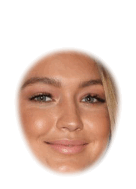

# Face alignment and windowing
This directory `demo_1_alignment` consists of a Python script `run_demo.py` and a directory `faces` of face images that we want to align and window.

Go ahead and run this demo now. You do not need to change anything for it to work.

```
python run_demo.py
```

# What is in this directory?
We call `faces` our **source directory** as it contains all the images we want to process.
You can name your **source directory** whatever you want.
<!-- # tree -I '*aligned|*windowed' -d -->
```
.
├── run_demo.py
└── faces
    ├── popular
    │   ├── females
    │   └── males
    └── premium
        ├── men
        └── women
```
The images are in the deepest subdirectory of `faces`: `male`, `female`, `men` and `women`.
There are 30 faces across these subdirectories so I omitted their names from this tree.

As you will see, AFA is careful to respect the directory structure of your **source directory**.

Here is a montage of all the photos we will be aligning and windowing:


# Understanding run_demo.py
The first step is to import AFA
```python
import alignfaces2 as afa
```
and specify the full path of your **source directory**, like this for example
```python
my_faces_path = "/users/bob/my_face_experiment/faces/"
```
Do not change anything in `run_demo.py`. It will automatically find the `faces` folder for this demo.
However, you will need to specify the **source directory** for your own projects.

# Landmark detection
Before we can align the faces, we must detect landmarks.
```python
# Analyze all image files whose filenames have these properties ...
file_prefix = ""
file_postfix = "jpg"

# Estimate landmarks.
af.get_landmarks(my_faces_path, file_prefix, file_postfix, start_fresh=True)
```

This will detect facial landmarks in each of the images found in `my_faces_path` whose file names end in `jpg`. If you want to process only those images whose filenames start with "V-" and you do not care what file extension (image type) is used then you would set
```python
file_prefix = "V-"
file_postfix = ""
```
We recommend that you always supply a non-empty argument to `file_postfix` just in case you include a non-image file inside your **source directory**.

If you had already run this command on a large database but were interrupted then you can rerun this command with `start_fresh=False`. Doing this will use temporary results files to begin work where analysis was interrupted. It can save you time.

The results are stored in a JSON-formatted file named `landmarks.txt` within the **source directory**.

```
.
├── run_demo.py
└── faces
    ├── landmarks.txt
    ├── popular
    │   ├── females
    │   └── males
    └── premium
        ├── men
        └── women
```

Here is an example of one entry in `landmarks.txt`, which corresponds to one of the 30 images:
```json
{
    "popular/females/ariana-grande.jpg": {
        "left_eyebrow": [334.0, 316.0, 350.0, 307.0, 366.0, 302.0, 383.0, 301.0, 400.0, 302.0],
        "left_eye": [348.0, 340.0, 359.0, 328.0, 373.0, 326.0, 385.0, 331.0, 376.0, 339.0, 362.0, 341.0],
        "right_eyebrow": [250.0, 318.0, 261.0, 312.0, 274.0, 312.0, 288.0, 315.0, 301.0, 320.0],
        "right_eye": [ 268.0, 340.0, 278.0, 333.0, 292.0, 334.0, 303.0, 343.0, 291.0, 347.0, 277.0, 346.0 ],
        "nose": [ 321.0, 340.0, 322.0, 358.0, 323.0, 377.0, 325.0, 395.0, 310.0, 400.0, 318.0, 405.0, 327.0, 408.0, 336.0, 403.0, 345.0, 399.0 ],
        "mouth_outline": [ 299.0, 415.0, 312.0, 415.0, 322.0, 414.0, 330.0, 416.0, 340.0, 414.0, 353.0, 413.0, 371.0, 412.0, 355.0, 428.0, 342.0, 436.0, 331.0, 437.0, 322.0, 436.0, 312.0, 431.0, 305.0, 419.0 ],
        "mouth_inner": [ 322.0, 424.0, 330.0, 424.0, 340.0, 423.0, 363.0,  415.0, 340.0, 421.0, 330.0, 423.0, 322.0, 422.0 ],
        "jawline": [ 243.0, 332.0, 247.0, 354.0, 252.0, 377.0, 258.0, 401.0, 269.0, 421.0, 285.0, 437.0, 302.0, 453.0, 320.0, 470.0, 340.0, 475.0, 362.0, 469.0, 383.0, 452.0, 402.0, 432.0, 419.0, 410.0, 428.0, 385.0, 432.0, 358.0, 432.0, 329.0, 433.0, 299.0 ],
        "left_iris": [ 367.0, 334.0 ],
        "right_iris": [ 284.0, 340.0 ]
    },
}
```

You can see that the top-level label for an entry is the relative path name of the associated image file. To obtain the full path name, you would concatenate your **source directory** and this label.

Associated with each image label is an array of coordinates for each of the 10 facial features: `left_eyebrow`, `left_eye`, `right_eyebrow`, `right_eye`, `nose`, `mouth_outline`, `mouth_inner`, `jawline`, `left_iris`, and `right_iris`. Array elements are ordered by pairs of X and Y positions for each landmark associated with that feature. For example, the first landmark for Ariana Grande's `left_eyebrow` is the point (X=334, Y=316).

DLIB calculates 68 landmarks distributed among 8 facial features, ranging from `left_eyebrow` to `jawline`. However, AFA calculates `left_iris` and `right_iris`, which are simply the mean X and Y values for `left_eye` and `right_eye`, respectively. These two features are calculated for convenience in later processing.

Additional features can be computed by the user of AFA by:
```python
landmark_features, files = afa.get_landmark_features(my_faces_path)
```
`landmark_features` is a Python dict with the original landmark data, as well as derived variables like the tilt of the line connecting the centers of left and right eyes, and the distance between the center of the mouth and midpoint between eyes.

Very rarely, DLIB may fail to detect a face. In that case, there will not be an entry for that face in `landmarks.txt`.

SOMETHING ABOUT DLIB ACCURACY FROM ORIGINAL PAPER.
SOMETHING ABOUT USAGE OF DLIB IN RESEARCH AND COMMERCIAL PRODUCT.

We did our own evaluation of DLIB landmark placement using the visual inspection described next.
The results of that are described [here](../../results/README.md)

# Visual inspection of landmark accuracy
DLIB is highly reliable. However, we recommend that each set of landmarks is visually inspected to confirm accuracy. One can call this function:
```python
afa.plot_faces_with_landmarks_one_by_one(my_faces_path)
```
And each face image will be shown with landmarks overlaid like this:

Each image is inspected one at a time. The file name, including relative file path, is shown at the bottom of each face. If landmarks are not accurate, then the user should record that file name in a CSV format file called `bad-landmarks.csv` (within `my_faces_path`) with content that looks like this for example:
```
premium/men/corey-haim.jpg, popular/females/gigi-hadid.jpg
```
If we thought that landmarks for these two images are poor. After creating `bad-landmarks.csv` and putting it in `my_faces_path`, we would then call this function:

```python
afa.exclude_files_with_bad_landmarks(my_faces_path)
```
This function ensures that the images listed in `bad-landmarks.csv` are excluded form all subsequent analyses. Basically, a new `landmarks.txt` file is created with the bad images removed and the original is saved as `landmarks-original.txt`.

All of the landmark placements were excellent in this demo, so the above is just for the sake of illustration.

# Alignment
Now that we have the landmarks for all the faces in `my_faces_path`, we can now
use General Procrustes Analysis (GPA) to align all of faces so that facial features are as overlapping with each other as possible:
```python
aligned_path = afa.align_procrustes(my_faces_path, file_prefix, file_postfix,
                                   color_of_result="rgb")
```
The values for `my_faces_path`, `file_prefix` and `file_postfix` should be the same as previously used during the call to `afa.get_landmarks()`.

The default for `color_of_result` is `grayscale` but is set to `rgb` (color image output) for this demo.

This command creates new images with aligned faces like this:


Notice that the faces are also cropped in a regular fashion such that image dimensions are just large enough to contain the heads of every person. Finally, faces are adjusted to have a fully upright orientation in the image plane.

Where do these aligned faces now reside on your computer?

AFA creates a new folder for aligned faces that is within the same folder (`demo_1_alignment`) that contains the source folder (`my_faces_path`). The name of this new folder is a concatenation of `my_faces_path` and `-aligned`. In our case, `my_faces_path` is `faces` so our new folder of aligned faces is `faces-aligned`, as shown below:

<!-- # tree -I '*windowed' -d -->
```
.
├── run_demo.py
├── faces
│   ├── popular
│   │   ├── females
│   │   └── males
│   └── premium
│       ├── men
│       └── women
└── faces-aligned
    ├── popular
    │   ├── females
    │   └── males
    └── premium
        ├── men
        └── women
```
The content of `faces-aligned` is essentially a full copy of `faces` except that each image has been affine transformed and cropped so that all faces are aligned with each other.

Here is a call to `afa.align_procrustes()` with all of the parameters and their default values.

```python
aligned_path = afa.align_procrustes(my_faces_path, file_prefix='',  
                                    file_postfix='jpg',
                                    exclude_features=['jawline', 'left_iris', 'right_iris', 'mouth_inner'],
                                    include_features=None, adjust_size='default', size_value=None, color_of_result='grayscale')
```

There are 4 other parameters that deserve mention.

The two parameters `exclude_features` is a list of labels for facial features that are to be excluded from consideration when aligning the faces. By default, `jawline` is excluded and we recommend to users that it should always be excluded.
In our experience, all of the landmarks returned by DLIB are highly accurate except for those associated with `jawline`. In fact, the default parameters result in the best alignments. If one would rather base alignment on a few facial features then it is easier to provide a list of labels to `include_features`, which overrides any arguments provided to `exclude_features`. Providing an argument to `include_features` can be useful if for example one wanted to perform a more conventional alignment that is based only on the eyes like this:
```python
include_features = ['left_eye', 'right_eye']
```

The parameter `adjust_size` can be set to one of 4 different strings:
`set_eye_distance`, `set_image_width`, `set_image_height` or `default`.
This allows the user to set the size of the aligned images based on either eye-distance, image width, image height or to use default values for all of these dimensions. If non-default values are used then `size_value` must be set to the value required in pixel units. For example, we can supply these arguments to `afa.align_procrustes()`
```python
adjust_size="set_image_width", size_value = 256
```
This will ensure that all aligned images have a width of 256 pixels, and the rest of the dimensions are set according to fixed proportions among these dimensions. Those fixed proportions are important to ensure that the entire head is contained within the image, and any subsequent generation of an image window (next section) will work correctly.

We evaluated the GPA-based alignment process used by AFA, and the results are described [here](../../results/README.md)

# Windowing
Before we can generate an image window that is appropriate for our aligned faces we must first obtain landmarks for these aligned faces:
```python
afa.get_landmarks(aligned_path, file_prefix, file_postfix)
```
`aligned_path` was already supplied as output from our previous call to `afa.align_procrustes()` and we supply the same arguments to `file_prefix` and `file_postfix` as before.

Now we are ready to generate an image window and create a new set of windowed images by applying it to every aligned face in the form of an alpha channel:
```python
the_aperture, aperture_path = afa.place_aperture(aligned_path, file_prefix,
                                                file_postfix,
                                                aperture_type="MossEgg",
                                                contrast_norm="max",
                                                color_of_result="rgb")
```
We supply the same arguments to `aligned_path`, `file_prefix` and `file_postfix` as before.

This command creates new images with aligned faces like this:


Where do these aligned faces now reside on your computer? In this demo, in a folder named `faces-aligned-windowed` as shown below:
<!-- # >> tree -d -->
```
.
├── run_demo.py
├── faces
│   ├── popular
│   │   ├── females
│   │   └── males
│   └── premium
│       ├── men
│       └── women
├── faces-aligned
│   ├── popular
│   │   ├── females
│   │   └── males
│   └── premium
│       ├── men
│       └── women
└── faces-aligned-windowed
    ├── popular
    │   ├── females
    │   └── males
    └── premium
        ├── men
        └── women
```
The parameter `color_of_result` can be set to either `rgb` for color or `grayscale`.
There are two types of aperture shape: `MossEgg` which is shown here, and `Ellipse`.
`MossEgg` is the preferred aperture shape for showing as much of the inner facial features as possible while showing as little of the rest of the face.

When `contrast_norm` is set to `max`, we ensure that image values within the aperture area have the largest range possible - between 0 and 255. See the `contrast_tools` module for other options.


<!--  -->
