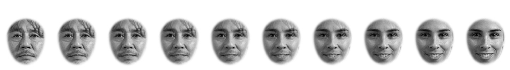

# Morphing between faces

In this folder, we provide an example Python script that uses AFA to gradually morph [Choi Min-sik](https://en.wikipedia.org/wiki/Choi_Min-sik) (on the far left) into [Sarah Silverman](https://en.wikipedia.org/wiki/Sarah_Silverman) (on the far right) in 9 equal steps:
```
python run_demo.py
```
Note that when we say "9 equal steps" we are not talking about a psychophysical quantity but are referencing the procedure we use to create morphs: the proportion of face A and B that are averaged together (as described in next section).

## Explanation
When we produce an intermediate morph between face A and B we need to first specify how much of either face the morph will look like. We use a proportion `p` that ranges between 0 and 1. When `p=0.50` we have equal contributions from both faces. When `p=0.10` we have 10-percent of face A and 90-percent of face B.

To produce an intermediate morph between faces A and B, we need to warp both faces to fit a common coordinate system. Using `p`, we calculate a weighted average of the landmarks of face A and B. For example, the top-left corner of the left eyebrow of the facial morph will be in an intermediate position between faces A and B.

Next, both face A and B are warped onto these average landmarks. Finally, the morph face is a weighted average of these warped faces, according to the value of `p`.

The user of AFA need only specify the number of morphs required between face A and B, and the resulting morph faces will be produced in equal steps of `p`.

To better see the quality of the morphs, here is a GIF that cycles between the morphs produced by this demo:


## run_demo.py
First we create a new folder `an-unusual-pair` that contains only the 2 faces we wish to morph into each other.

Before morphs can be made, the faces must be aligned and landmarks for those aligned faces should be calculated:

```python
af.get_landmarks(source_dir, file_prefix, file_postfix)
aligned_path = af.align_procrustes(source_dir, file_prefix, file_postfix,
                                   color_of_result="rgb")
af.get_landmarks(aligned_path, file_prefix, file_postfix)
```
Once this is done, we can now produce a morph between Choi Min-sik and Sarah Silverman in 9 equal steps:

```python
do_these = [0, 1]
num_morphs = 10

face_array, p, morph_path = af.morph_between_two_faces(aligned_path,
                                                       do_these=do_these,
                                                       num_morphs=num_morphs,
                                                       file_prefix=file_prefix,
                                                       file_postfix=file_postfix,
                                                       new_dir = "morphed",
                                                       weight_texture=True)
```
The variable `do_these` refers to which faces to morph together. Because there are only 2 faces in our `source_dir`, setting `do_these = [0, 1]` is all we need to do. This is the easiest and recommended method. If `source_dir` has more than 2 faces, then we need to figure out what **index value** refers to which image. Indices can be determined by calling:
```python
files = get_source_files(aligned_path, file_prefix, file_postfix)
```
The variable `files` is an list of filenames in `aligned_path`. The first filename has an index of 0, the second has an index of 1 and so on.

Our call to `morph_between_two_faces` produces all of the morph images and writes them to the folder specified by `morph_path`. The filenames of the morphs range from **N0.png** for face A to **N10.png** for face B. If we wanted 20 morphs then the filenames would range from **N0.png** for face A to **N20.png** for face B.

Finally, if we want to window our morph faces so that only inner facial features are shown, then we can do this:
```python
the_aperture, aperture_path = af.place_aperture(morph_path, "N",
                                                "png",
                                                aperture_type="MossEgg",
                                                contrast_norm="max",
                                                color_of_result="rgb")
```
