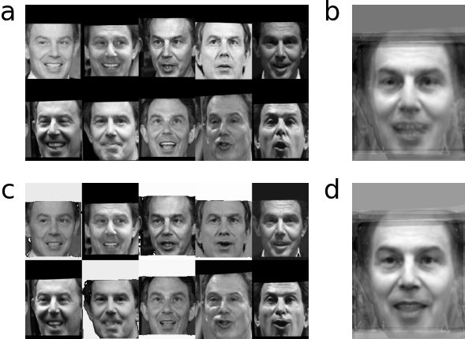

# Enhanced facial average
In this folder, we provide an example Python script that uses AFA to generate an enhanced average of Angela Merkel's face:
```
python run_demo.py
```
## Explanation
Ten different photos of Angela Merkel are in the folder `faces-of-merkel`.

We used AFA to align all of these faces, shown in panel (a) of the figure below.



We show a simple average of the aligned faces in panel (b). This looks decent but there are some artifacts. AFA alignment only performs affine transforms of the entire image in order to minimize deviations in landmark positions. So the facial features will not be in the exact same position across faces in panel (a), and the resulting average (b) will combine features imprecisely.

We can do better by warping each of the aligned faces in order to match a common coordinate system, shown in panel (c). First we calculate the average of landmarks across faces. Then we warp each of the aligned faces so that landmarks are repositioned to match the average landmarks. **Consequently, landmark positions are the same for each of the faces shown in panel c.** The average of these warped faces is shown in panel d.

As you can see by comparing panels b and d, the average-of-warps (d) shows a greater clarity in the local contrast of facial features compared to the simple average (b).

## run_demo.py
Before an enhanced average can be made, the faces must be aligned and landmarks for those aligned faces should be calculated:

```python
# Estimate landmarks.
af.get_landmarks(my_faces_path, file_prefix, file_postfix, start_fresh=True)

# Now we're ready to align the faces - via generalized Procrustes analysis.
aligned_path = af.align_procrustes(my_faces_path, file_prefix, file_postfix)

# Estimate landmarks of aligned faces.
af.get_landmarks(aligned_path, file_prefix, file_postfix)
```

Once this is done, you can now warp each of the aligned faces to the mean of landmarks across faces:

```python
# Warp each face to mean of landmarks
original_images, warped_to_mean = af.warp_to_mean_landmarks(aligned_path,
                                                            file_prefix=file_prefix,
                                                            file_postfix=file_postfix)
```
This returns all of the warped faces in a single NUMPY array `warped_to_mean` that can be averaged like this:

```python
# Mean of warped faces
enhanced_average = warped_to_mean.mean(axis=0)
```
`enhanced_average` is shown in panel d of the above figure, and `warped_to_mean` contains all of faces shown in panel c.

This **enhanced facial average** was first demonstrated by

> Burton, A. M., Jenkins, R., Hancock, P. J. B., & White, D. (2005). Robust representations for face recognition: The power of averages. Cogn Psychol, 51(3), 256–284. https://doi.org/10.1016/j.cogpsych.2005.06.003

We used the same photos of Angela Merkel as they used (in their Figure 3).

Manual landmark selection was required in Burton et al. (2005), whereas AFA automated the entire process in our demo.
