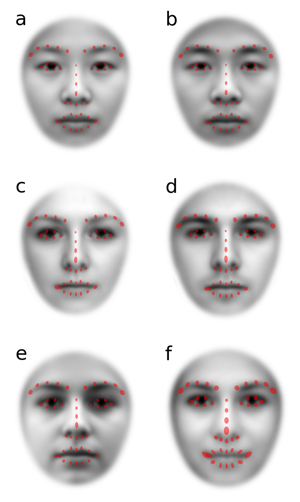

# Evaluation of DLIB and AFA
To test DLIB landmark detection and our GPA-based alignment procedure in the typical use-case for psychology researchers, we use 3 different databases of face photographs.

The databases we used: the CAS-PEAL database of Chinese faces (Gao et al., 2008); the Glasgow Unfamiliar Face Database GUFD (Burton et al., 2010); and faces from the Kent Face Matching Test KFMT (Fysh & Bindemann, 2018).

In particular, GUFD and KFMT are tailored to the study of face perception in realistic scenarios, so the faces from these databases were photographed with variable quality cameras and resolutions and allowed for natural poses instead of a strictly frontal-parallel orientation of the face.

Photographic subjects in both the GUFD and KFMT databases were allowed to have their hair worn in any fashion. And unlike the other two databases, photographic subjects in the KFMT database were allowed to wear glasses.

Image resolutions in width-by-height (pixels) are 360 x 480 and 350 x 518 for the CAS-PEAL and GUFD databases, respectively. KFMT was divided between KFMT-DC and KFMT-ID which were photos taken in-lab (283 x 332 pixels) and pre-existing photo-identification (142 x 192) obtained from the same people.

Given variability in the area occupied by faces across these databases (due to camera distance and focus), perhaps a better metric for image resolution that allows comparison across databases is the mean eye distance measured using AFA. Those eye distances (pixels) are listed in the table below.

## Replicate this analysis yourself
Contact the authors of these databases and request a copy of their faces. Put those faces into the appropriate folders in this directory. Then run the following AFA-driven Python scripts:


```
python results_1_preprocessing.py
```
This script will calculate landmarks for all faces in all databases.
It will then allow you to view each face with landmarks overlaid, one at a time.
Careful observation of each figure shows very few instances (13 out of 1959 total) where landmark placements are inaccurate.
A detailed breakdown of these **failed landmark placements** is in the table below.

The script also determines the number of **failed face detections**, which is very rare (1 out of 1959 total).

Among the many outputs is [table-DLIB-failures.csv](table-DLIB-failures.csv).

Finally, new aligned faces are generated and their landmarks are calculated.

```
python get_eye_distances_original.py
```
This simply measures the average distance between eyes (pixels) in each database. Output file is [table-eye-distances.csv](table-eye-distances.csv).

```
python results_2_main.py
```
For each database, visualize the distribution of each landmark across faces as an ellipsoid centered on the mean position of that landmark. Ellipsoid orientation is determined by a PCA on the values of X and Y coordinates across faces, and length and width are 2 times the standard deviations along the principal components. Ellipsoid size should be relatively small and somewhat uniform across landmarks if AFA does a good job of alignment.

For each database, these ellipsoids are then overlaid on the mean of aligned faces. If AFA does a good job of alignment, mean faces should have strong local contrast around facial features, relative to other parts of the face.

```
python make_figures.py
```
Simply put together the ellipsoid images written by previous script into a single figure.

```
python results_3_additional.py
```
Show landmarks overlaid on each aligned face for all faces in each database.
Visual inspection shows all landmark placement to be excellent in all of the aligned faces generated by AFA, and alignments to be good.


## DLIB performance

|Database	|Eye Distance, pixels	|Race	|n	|Failed Face Detections	|Failed Landmark Placement|
| :--- | :---: | :---: | :---: | :---: | :---: |
|CAS-female	|84	|Chinese	|437	|0	|0|
|CAS-male	|84	|Chinese|	589|	0|	0|
|GUFD-female	|112	|Predominantly Caucasian|	106|	0|	0|
|GUFD-male	|112	|Predominantly Caucasian|	323|	0|	0|
|KUFT-DC	|55	|Mostly Caucasian|	252|	0|	2|
|KUFT-ID	|43	|Mostly Caucasian|	252|	1|	10|
|Total|		|	|1959	|1	|12|

Using AFA, we use mean eye-distance in pixels measured on the original faces as a measure of resolution for each database.

The 2 cases of failed landmark placement for KUFT-DC are for subjects wearing glasses.

Among the 10 cases of failed landmark placement for KUFT-ID: 5 are for subjects wearing glasses, 1 is for a subject with an pose that is highly deviant from frontal-parallel, 1 is for a subject with hair covering an eyebrow. The other (3) cases are difficult to explain but they were all non-Caucasian (Black specifically) and we suspect that this deserves greater attention.

## AFA performance

Distributions of landmarks (red ellipses) overlaid on mean of GPA-aligned images. Ellipse orientation based on angle between first and second eigenvectors of PCA applied to landmarks across all faces in a single category. Ellipse length and width are 2 SD of variability along those eigenvectors. Analysis is done separately for 4 categories of faces: Chinese females from the CAS database (a); Chinese males from the CAS database (b); predominantly Caucasian female faces from the GUFD database (c); predominantly Caucasian male faces from the GUFD database (d); in-lab photos of mostly Caucasian faces (mixed gender) from the KUFD database; and low-resolution photo-ID of mostly Caucasian faces (mixed gender and expression) from the KUFD database. Despite SD being a non-robust measure of variability that is strongly inflated by outliers, each ellipse is quite small relative to the size of facial features. Ellipse sizes are also roughly uniform across the different landmarks. The means of aligned faces have high contrast and normal-looking facial features. That provides additional, qualitative validation of the entire GPA-alignment process performed by AFA (including landmark detection).

## References
>Gao, W., Cao, B., Shan, S., Chen, X., Zhou, D., Zhang, X., & Zhao, D. (2008). The CAS-PEAL large-scale Chinese face database and baseline evaluations. IEEE Transactions on Systems, Man, and Cybernetics-Part A: Systems and Humans, 38(1), 149–161.

>Burton, A. M., White, D., & McNeill, A. (2010). The Glasgow Face Matching Test. Behavior Research Methods, 42(1), 286–291. https://doi.org/10.3758/BRM.42.1.286

>Fysh, M. C., & Bindemann, M. (2018). The Kent Face Matching Test. British Journal of Psychology, 109(2), 219–231. https://doi.org/10.1111/bjop.12260

# Evaluation of DLIB and AFA with emotionally expressive faces
1. nim_1_preprocessing.py [get landmarks]
    2. nim_1b_table_of_bad_lm.py
    3. nim_1b_table_of_bad_lm.R
2. nim_1_preprocessing.py [alignment]
4. nim_2_main.py
5. nim_3_additional.py


## nim_1_preprocessing.py
Do for each of 16 folders of faces.
Visual inspection of landmarks overlaid on photos.
Within each folder:
    - **bad-landmarks.csv**         [mouth ignored]
    - **bad-landmarks-strict.csv**  [mouth considered for exclusion]

## nim_1b_table_of_bad_lm.py
**bad-landmarks** files -> **table-DLIB-bad-landmarks-NIM.csv**

## nim_1b_table_of_bad_lm.R
**table-DLIB-bad-landmarks-NIM.csv** -> **table-wide-DLIB-bad-landmarks-NIM.csv**

Copy and paste into a Word table: **/manuscript/table-nim-stim-bad-landmarks.docx**
Select table values and "convert to table".

## nim_1_preprocessing.py
Run second part:
1. exclude bad landmarks (not strict)
2. make table
For total numbers of photos in each category and number of failed DLIB detections:
**table-DLIB-failures-NIM.csv**
There are 0 failed detections 😆
3. align faces
    - **TO DO** modify script to exclude mouth when aligning!
        - exclude_features=['jawline', 'left_iris', 'right_iris',
        'mouth_inner', 'mouth_outline']
    - **ANTICIPATE PROGRAMMING**
        - Cropping parameters will be different now!!!!!!
        - Simply shift vertically rows by (old cog - new cog)
            - cog mean of all landmarks
        - CODE THIS AS A PROPORTION OF EYE DISTANCE
        - Invoke shift if all mouth_inner and mouth_outline are excluded


# How does cropping normally work.
After centring centroid to (0,0) and aligning, an additional translation shifts
the image down by 5/12 times eye-distance, which ensures the entire head is
within the image.

# Statistics of mean landmarks for various databases
Statistics for post alignment landmarks. Reference eye distance is 94 pixels.

| Database | Centroid with mouth - Centroid without mouth |
| :------: | :------: |
| CAS-female | 29.36842105263158 |
| CAS-male | 29.69100169779287 |
| GUFD-female | 28.11320754716981 |
| GUFD-male | 29.04953560371517 |

-> landmarks.txt
-> mean of landmarks (included with alignment)
    -> centroid
-> mean of landmarks (included with alignment without mouth)
    -> centroid

Average centroid with mouth - centroid without mouth = 29 pixels
As a fraction of eye distance in pixels = 29 / 94

af.get_landmark_features(source_dir, output_dir="", exclude_features=['jawline',
                          'left_iris', 'right_iris', 'mouth_inner'])

# Addition to make_aligned_faces

In ```align_procrustes```, starting at line 787.

```
if exclude_features includes both mouth_inner and mouth_outline:

shift image up by (29/94) x eye_distance
```

For eyes only, very similar shift (32.5 / 94) x eye_distance!!!

```
ema = "mouth_inner" in exclude_features
emb = "mouth_outline" in exclude_features
if (ema and emb):


```

1. Make change starting at line 787 🚀
1. Test results/nim_1_preprocessing
    - problem installing
    - line 15 of setup.py

``README = (BASE_LOCATION.parent / "README.md").read_text()``
Do a test where I print this out to see if properly specified.


# NOT updating directory
***REMEMBER TO UPDATE ALL SCRIPTS TO USE IMPORT ALIGNFACES INSTEAD OF ALIGNFACES2***

0. Revise demo scripts to import alignfaces instead of alignfaces2 🚀
1. Do full reinstall and test of alignfaces using quick install.🚀
2. Finish NIM STIM.🚀
    - still need to nim_3_additional.py [just a check on aligned landmarks]😊
3. [LATER] Revise results scripts to import alignfaces instead of alignfaces2


CV
emails to interns et cetera
prepare for tomorrow's classes
- 425-002 Similarity Lecture
- 466-001 t-test lecture (FIND)
