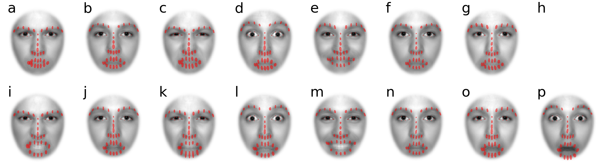

# Evaluation of DLIB and AFA
To test DLIB landmark detection and our GPA-based alignment procedure in the typical use-case for psychology researchers, we use 3 different databases of face photographs. The vast majority of faces from these 3 databases were emotionally neutral. We did an additional assessment using a fourth database of faces that varied in emotional expression.

The databases we used: the CAS-PEAL database of Chinese faces (Gao et al., 2008); the Glasgow Unfamiliar Face Database GUFD (Burton et al., 2010); faces from the Kent Face Matching Test KFMT (Fysh & Bindemann, 2018); and emotionally expressive faces from the NimStim database (Nim et al., 2009). Analyses are reported separately for the neutral (first 3 databases) and expressive sets (NimStim database).

In particular, GUFD and KFMT are tailored to the study of face perception in realistic scenarios, so the faces from these databases were photographed with variable quality cameras and resolutions and allowed for natural poses instead of a strictly frontal-parallel orientation of the face.

Photographic subjects in both the GUFD and KFMT databases were allowed to have their hair worn in any fashion. And unlike the other two databases, photographic subjects in the KFMT database were allowed to wear glasses.

Photographic subjects in the NimStim database of emotionally expressive faces were professional actors from diverse ethnic/racial backgrounds (10 African, 6 Asian, 25 European and 2 Latino-American). There were 8 different emotional expressions, each with open- and closed-mouth versions (a total of 16 categories). Identification of expressions is both accurate and reliable (Nim et al., 2009).

Image resolutions in width-by-height (pixels) are 360 x 480 and 350 x 518 for the CAS-PEAL and GUFD databases, respectively. KFMT was divided between KFMT-DC and KFMT-ID which were photos taken in-lab (283 x 332 pixels) and pre-existing photo-identification (142 x 192) obtained from the same people.

Given variability in the area occupied by faces across these databases (due to camera distance and focus), perhaps a better metric for image resolution that allows comparison across databases is the mean eye distance measured using AFA. Those eye distances (pixels) are listed in the table below.

## Replicate this analysis yourself
Contact the authors of these databases and request a copy of their faces. Put those faces into the appropriate folders in this directory. Then run the following AFA-driven Python scripts:


```
python results_1_preprocessing.py
```
This script will calculate landmarks for all faces in all databases.
It will then allow you to view each face with landmarks overlaid, one at a time.
Careful observation of each figure shows very few instances (13 out of 1959 total) where landmark placements are inaccurate.
A detailed breakdown of these **failed landmark placements** is in the table below.

The script also determines the number of **failed face detections**, which is very rare (1 out of 1959 total).

Among the many outputs is [table-DLIB-failures.csv](table-DLIB-failures.csv).

Finally, new aligned faces are generated and their landmarks are calculated.

```
python get_eye_distances_original.py
```
This simply measures the average distance between eyes (pixels) in each database. Output file is [table-eye-distances.csv](table-eye-distances.csv).

```
python results_2_main.py
```
For each database, visualize the distribution of each landmark across faces as an ellipsoid centered on the mean position of that landmark. Ellipsoid orientation is determined by a PCA on the values of X and Y coordinates across faces, and length and width are 2 times the standard deviations along the principal components. Ellipsoid size should be relatively small and somewhat uniform across landmarks if AFA does a good job of alignment.

For each database, these ellipsoids are then overlaid on the mean of aligned faces. If AFA does a good job of alignment, mean faces should have strong local contrast around facial features, relative to other parts of the face.

```
python make_figures.py
```
Simply put together the ellipsoid images written by previous script into a single figure.

```
python results_3_additional.py
```
Show landmarks overlaid on each aligned face for all faces in each database.
Visual inspection shows all landmark placement to be excellent in all of the aligned faces generated by AFA, and alignments to be good.


## DLIB performance (neutral expression)

|Database	|Eye Distance, pixels	|Race	|n	|Failed Face Detections	|Failed Landmark Placement|
| :--- | :---: | :---: | :---: | :---: | :---: |
|CAS-female	|84	|Chinese	|437	|0	|0|
|CAS-male	|84	|Chinese|	589|	0|	0|
|GUFD-female	|112	|Predominantly Caucasian|	106|	0|	0|
|GUFD-male	|112	|Predominantly Caucasian|	323|	0|	0|
|KUFT-DC	|55	|Mostly Caucasian|	252|	0|	2|
|KUFT-ID	|43	|Mostly Caucasian|	252|	1|	10|
|Total|		|	|1959	|1	|12|

Using AFA, we use mean eye-distance in pixels measured on the original faces as a measure of resolution for each database.

The 2 cases of failed landmark placement for KUFT-DC are for subjects wearing glasses.

Among the 10 cases of failed landmark placement for KUFT-ID: 5 are for subjects wearing glasses, 1 is for a subject with an pose that is highly deviant from frontal-parallel, 1 is for a subject with hair covering an eyebrow. The other (3) cases are difficult to explain but they were all non-Caucasian (Black specifically) and we suspect that this deserves greater attention.

## DLIB performance (emotionally expressive)
Can emotionally expressive faces be successfully aligned using AFA?
DLIB's landmark detector was trained mostly on faces either a near neutral expression, or a slight smile. It is possible that DLIB may either fail to detect a face or provide poor estimates of landmarks.

There were no failed face detections.

### Number of Failed Landmark Placements (conservative)

Visual inspection of landmarks overlaid on the photos show that mouths were the most poorly estimated by DLIB. We can reject a face based on all landmark estimates, including those of the mouth. That provide a conservative estimate of landmark accuracy, with greater numbers of rejected faces. The table below shows the total number of faces with bad landmarks in each of the emotion categories according to this conservative criterion. Total number in each category are in parentheses.

|Mouth|	Angry|	Calm|	Disgust|	Fear|	Happy|	Neutral|	Sad|	Surprised|
| :-- | :-- | :-- | :-- | :-- | :-- | :-- | :-- | :-- |
|Open	|9 (42)|	2 (41)|	31 (42)|	3 (42)|	1 (42)|	1 (41)|	3 (41)|	7 (42)|
|Closed	|1 (42)|	1 (41)|	7  (40)|	4 (37)|	1 (41)|	1 (42)|	4 (41)|	1  (2)|


### Number of Failed Landmark Placements (liberal)

Given the poor estimation of mouth landmarks for some categories of emotionally expressive faces (disgust and anger), it might be best to exclude mouth landmarks when aligning faces with AFA. In this table, we show the total number of faces with bad landmarks in each of the emotion categories according to this liberal criterion (not considering the mouth).

|Mouth|	Angry|	Calm|	Disgust|	Fear|	Happy|	Neutral|	Sad|	Surprised|
| :-- | :-- | :-- | :-- | :-- | :-- | :-- | :-- | :-- |
|Open|	    1 (42)|	1 (41)|	1   (42)|	1 (42)|	1 (42)|	1 (41)|	1 (41)|	3 (42)|
|Closed|	1 (42)|	1 (41)|	1   (40)|	1 (37)|	1 (41)|	1 (42)|	1 (41)|	1 (2)|

These results are quite good considering that photographic subjects are repeated across category and a single individual is responsible for most of the failed landmarks in this table.

## AFA performance (neutral expression)
<!--  -->


Distributions of landmarks (red ellipses) overlaid on mean of GPA-aligned images. Ellipse orientation based on angle between first and second eigenvectors of PCA applied to landmarks across all faces in a single category. Ellipse length and width are 2 SD of variability along those eigenvectors. Analysis is done separately for 4 categories of faces: Chinese females from the CAS database (a); Chinese males from the CAS database (b); predominantly Caucasian female faces from the GUFD database (c); predominantly Caucasian male faces from the GUFD database (d); in-lab photos of mostly Caucasian faces (mixed gender) from the KUFD database; and low-resolution photo-ID of mostly Caucasian faces (mixed gender and expression) from the KUFD database. Despite SD being a non-robust measure of variability that is strongly inflated by outliers, each ellipse is quite small relative to the size of facial features. Ellipse sizes are also roughly uniform across the different landmarks. The means of aligned faces have high contrast and normal-looking facial features. That provides additional, qualitative validation of the entire GPA-alignment process performed by AFA (including landmark detection).

## AFA performance (emotionally expressive)


<!-- expression = ["an", "ca", "di", "fe", "ha", "ne", "sa", "sp"] -->

Distributions of landmarks (red ellipses) overlaid on mean of GPA-aligned images of emotionally expressive faces. Unlike in the previous figure, alignments for these faces were based only on eye landmarks.
[a to h] corresponds to anger, calm, disgust, fear, happy, neutral, sad, and surprised for closed mouth expressions. There was only 1 face available for closed-mouth surprise so that category has been excluded. [i to p] corresponds to anger, calm, disgust, fear, happy, neutral, sad, and surprised for open mouth expressions. As can be seen by the size of red ellipses around the eyes and the strong local contrast of eyes in the mean faces, AFA does an excellent job of aligning by eye landmarks alone. As expected from common experience, landmark variability is largest around the mouth.


## References
>Burton, A. M., White, D., & McNeill, A. (2010). The Glasgow Face Matching Test. Behavior Research Methods, 42(1), 286–291. https://doi.org/10.3758/BRM.42.1.286

>Fysh, M. C., & Bindemann, M. (2018). The Kent Face Matching Test. British Journal of Psychology, 109(2), 219–231. https://doi.org/10.1111/bjop.12260

>Gao, W., Cao, B., Shan, S., Chen, X., Zhou, D., Zhang, X., & Zhao, D. (2008). The CAS-PEAL large-scale Chinese face database and baseline evaluations. IEEE Transactions on Systems, Man, and Cybernetics-Part A: Systems and Humans, 38(1), 149–161.

>Tottenham, Nim, James W. Tanaka, Andrew C. Leon, Thomas McCarry, Marcella Nurse, Todd A. Hare, David J. Marcus, Alissa Westerlund, BJ Casey, and Charles Nelson. “The NimStim Set of Facial Expressions: Judgments from Untrained Research Participants.” Psychiatry Research 168, no. 3 (August 15, 2009): 242–49. https://doi.org/10.1016/j.psychres.2008.05.006.
